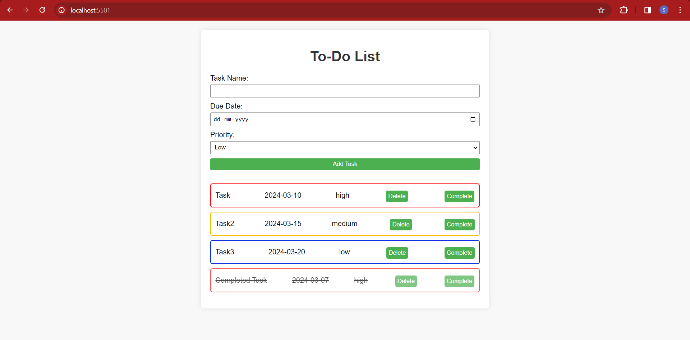
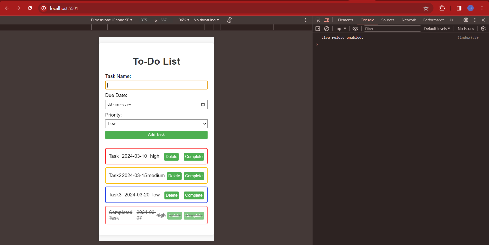

# Interactive To-Do List

Welcome to the Interactive To-Do List, a simple yet powerful tool designed to enhance your productivity and task management. This web application is crafted with HTML, CSS, and vanilla JavaScript, offering a seamless and user-friendly interface for managing your daily tasks. 

## Features

- **Task Addition:** Easily add tasks with details such as names, due dates, and priority levels (Low, Medium, High) to keep your schedule organized.
- **Task Deletion:** Remove tasks from your list as you complete them or adjust your priorities.
- **Mark as Completed:** Celebrate your accomplishments by marking tasks as completed. This feature changes the task's appearance in the list (e.g., a line-through style) to visually signify completion.
- **Priority Indication:** With visual differentiation based on priority levels, quickly identify which tasks require immediate attention and plan your day efficiently.

## Application Interface

The user-friendly interface allows for efficient task management:



## Responsive Design

Easily Adaptable for all screen Resolutions:



## Getting Started

To get a local copy up and running, follow these simple steps:

1. Clone the repo
   ```sh
   git clone https://github.com/srujanchidarla/Todo.git


